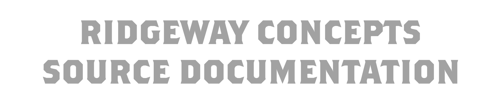

<h2>Hello!</h2>

Welcome to the new RWC documentation site!

Here you will find all of the current info regarding Ridgeway Concepts' opensourced APIs

I (Ally), otherwise known as ags816710 or EffortlessAlly shall be the main writer of this documentation!

Simply add Markdown files (or folders) to the `blog` directory.

Regular blog authors can be added to `authors.yml`.

The blog post date can be extracted from filenames, such as:

- `2019-05-30-welcome.md`
- `2019-05-30-welcome/index.md`

A blog post folder can be convenient to co-locate blog post images: